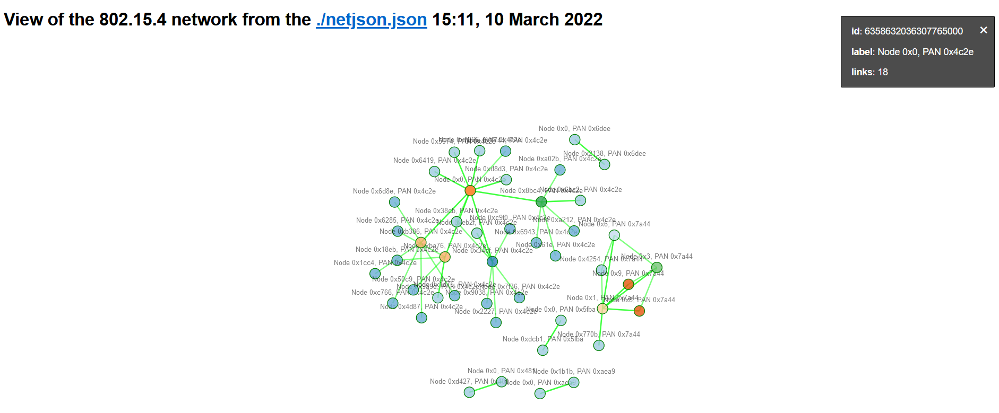

802.15.4 to netJSON
===================

A tool to visualize 802.15.4 Zigbee communication, can be useful for
Zigbee, Thread.

netJSON
-------

NetJSON is a data interchange format based on JSON designed to ease the
development of software tools for computer networks.

NetJSON defines several types of JSON objects and the manner in which
they are combined to represent a network: configuration of devices,
monitoring data, network topology and routing information.

Described in their website https://netjson.org/

This format comes with many tools to visualize the data. Here is used
netJSONgraph https://github.com/openwisp/netjsongraph.js for the html
visualization.

Scapy
-----

Scapy is the library used to parse the input PCAP.

Scapy is a powerful interactive packet manipulation program. It is able
to forge or decode packets of a wide number of protocols, send them on
the wire, capture them, match requests and replies, and much more. It
can easily handle most classical tasks like scanning, tracerouting,
probing, unit tests, attacks or network discovery (it can replace hping,
85% of nmap, arpspoof, arp-sk, arping, tcpdump, tshark, p0f, etc.).

It is the unique dependency of this library.

Usage
-----

Just need the PCAP filepath as input, can be piped. A ``--zigbee`` token
can be added to get read of the broadcast communication for a clearer
view. The serve token serve the netJSONgraph view of the netJSON opened in the
browser at http://localhost:8005/.

``python 802dot15dot4_to_netjson.py <PCAP filepath> --zigbee --serve``

install the dependency
----------------------

In your shell or console

``python -m pip install -r requirements.txt``
